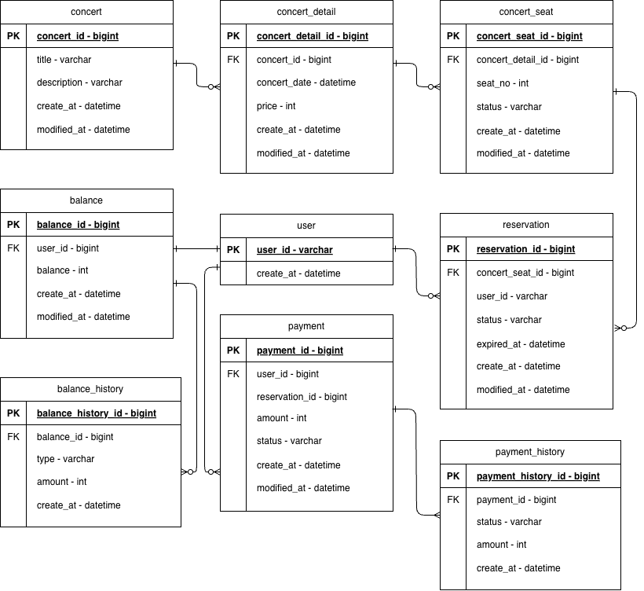

## ERD


## 엔티티(9개)
### concert
| Column        | Type      | Key | Description |
|--------------|-----------|-----|-------------|
| concert_id   | bigint    | PK  |             |
| title        | varchar   |     |             |
| description  | varchar   |     |             |
| create_at    | datetime  |     |             |
| modified_at  | datetime  |     |             |

### concert_detail
| Column            | Type      | Key | Description |
|------------------|-----------|-----|-------------|
| concert_detail_id | bigint   | PK  |             |
| concert_id        | bigint   | FK  |             |
| concert_date      | datetime |     |             |
| price             | int      |     |             |
| create_at         | datetime |     |             |
| modified_at       | datetime |     |             |

### concert_seat
| Column            | Type      | Key | Description         |
|------------------|-----------|-----|---------------------|
| concert_seat_id  | bigint    | PK  |                     |
| concert_detail_id| bigint    | FK  |                     |
| seat_no          | int       |     |                     |
| status           | varchar   |     | AVAILABLE, RESERVED |
| create_at        | datetime  |     |                     |
| modified_at      | datetime  |     |                     |

### user
| Column     | Type    | Key | Description |
|------------|---------|-----|-------------|
| user_id    | varchar | PK  |             |
| create_at  | datetime|     |             |

### balance
| Column     | Type      | Key | Description |
|------------|-----------|-----|-------------|
| balance_id | bigint    | PK  |             |
| user_id    | bigint    | FK  |             |
| balance    | int       |     |             |
| create_at  | datetime  |     |             |
| modified_at| datetime  |     |             |

### balance_history
| Column             | Type      | Key | Description           |
|-------------------|-----------|-----|-----------------------|
| balance_history_id | bigint   | PK  |                       |
| balance_id         | bigint   | FK  |                       |
| type               | varchar  |     | CHARGE, DEBIT, REFUND |
| amount             | int      |     |                       |
| create_at          | datetime |     |                       |

### reservation
| Column          | Type      | Key | Description                            |
|-----------------|-----------|-----|----------------------------------------|
| reservation_id  | bigint    | PK  |                                        |
| concert_seat_id | bigint    | FK  |                                        |
| user_id         | varchar   |     |                                        |
| status          | varchar   |     | PENDING, CONFIRMED, CANCELED, EXPIRED  |
| expired_at      | datetime  |     |                                        |
| create_at       | datetime  |     |                                        |
| modified_at     | datetime  |     |                                        |

### payment
| Column          | Type      | Key | Description       |
|----------------|-----------|-----|-------------------|
| payment_id     | bigint    | PK  |                   |
| user_id        | bigint    | FK  |                   |
| reservation_id | bigint    | FK  |                   |
| amount         | int       |     |                   |
| status         | varchar   |     | CAPTURED, FAILED  |
| create_at      | datetime  |     |                   |
| modified_at    | datetime  |     |                   |

### payment_history
| Column               | Type      | Key | Description                          |
|---------------------|-----------|-----|--------------------------------------|
| payment_history_id  | bigint    | PK  |                                      |
| payment_id          | bigint    | FK  |                                      |
| status              | varchar   |     | CAPTURED, FAILED, REFUNDED, CANCELED |
| amount              | int       |     |                                      |
| create_at           | datetime  |     |                                      |

## enum 정의(Java)
``` java
public enum SeatStatus {
    AVAILABLE,  // 예약 가능
    RESERVED    // 예약 완료
}

public enum BalanceType { 
    CHARGE, // 금액 충전  
    DEBIT, // 금액 사용
    REFUND // 금액 환불 
}

public enum ReservationStatus { 
    PENDING, // 예약 대기 
    CONFIRMED, // 예약 승인
    CANCELED, // 예약 취소
    EXPIRED // 기한 만료
}

public enum PaymentStatus { 
    CAPTURED, // 결제 성공
    FAILED // 결제 실패
}

public enum PaymentHistoryStatus { 
    CAPTURED, // 결제 성공
    FAILED, // 결제 실패
    REFUNDED, // 결제 환불
    CANCELED // 결제 승인 취소
}
```