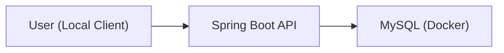
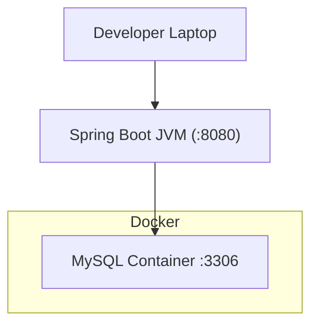

## Infra 구성도 (Local 환경)
### 1) High-Level 아키텍처
> 사용자는 API 서버로 REST 요청을 보내고,
애플리케이션은 MySQL을 통해 데이터를 영속 저장한다. 
현재 Redis 등 외부 캐시 컴포넌트는 사용하지 않는다.

### 2) 배포 다이어그램 (Local / Docker Compose 기반)
> 로컬 개발 환경에서는 Docker Compose를 사용하여
MySQL 컨테이너만 구동한다. 
애플리케이션(Spring Boot)은 로컬 JVM에서 실행한다.

### 3) 향후 확장 방안
본 서비스는 현재 단일 API 서버와 MySQL 기반으로 동작하지만,
트래픽 증가 및 운영 요구사항에 따라 아래 방향으로 확장할 수 있습니다.
- Redis 도입
  - 좌석 임시 배정(TTL) 처리
  - 대기열 토큰 관리
  - 세션/랭킹/캐싱으로 DB 부하 완화

- Kafka 등 메시지 브로커 도입
  - 이메일/푸시 알림 등 비동기 처리
  - 예약/결제 이벤트 스트리밍
  - 장애 시 재시도 및 지연 허용 작업 분리
  
- 클라우드 인프라 전환(AWS 등)

- 컨테이너 오케스트레이션(Kubernetes/ECS)

