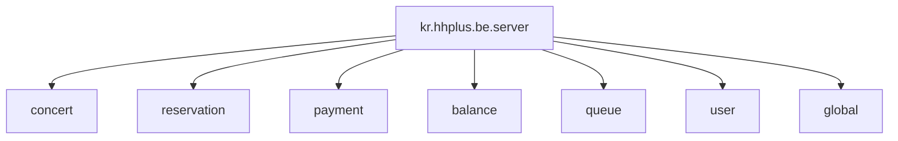
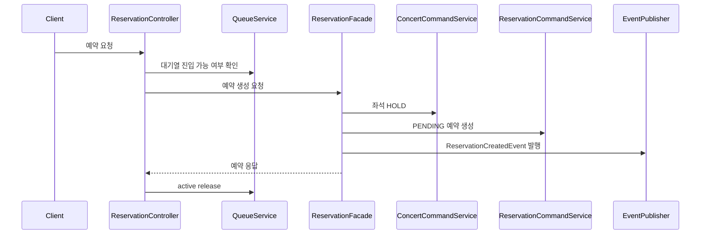
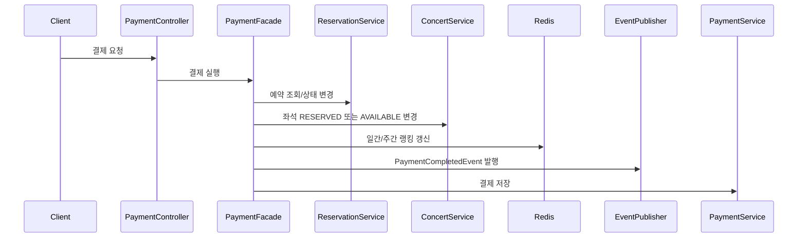

# [REFACTOR-1] 프로젝트 전체 구조 진단

## 목표

현재 콘서트 예약 서버의 전체 구조를 진단하고, 이후 단계별 리팩토링의 기준을 정리한다.

이 단계는 비즈니스 로직을 변경하지 않는다. 코드 수정 전에 구조, 책임 경계, 위험 지점, 문서화 기준을 먼저 고정한다.

## 현재 구조

### 도메인 구성

주요 도메인은 `concert`, `reservation`, `payment`, `balance`, `queue`, `user`로 나뉘어 있다. 각 도메인은 대체로 `api`, `application`, `domain`, `infrastructure` 계층을 갖는다.

### 예약 흐름

### 결제 흐름

## 진단 결과

### 서버 구조

- 도메인별 패키지 분리는 되어 있으나 일부 패키지명과 계층 책임이 정리되지 않았다.
- `reservation.appication` 패키지명은 오타로 보이며 `reservation.application`으로 정리할 필요가 있다.
- controller가 일부 use case 흐름 제어를 직접 담당한다.
- Kafka 실습용 코드가 production 코드 경로에 있어 운영 runtime에서 실행될 수 있다.

### 예약/좌석

- 예약 토큰 검증/소비가 주석 처리되어 있다.
- 좌석 상태 변경에 Redis 분산락과 DB pessimistic lock이 함께 사용된다.
- 좌석 상태 전이 규칙과 예약 만료 시 좌석 복구 정책이 충돌할 가능성이 있다.

### 결제

- `PaymentFacade`가 예약 상태 변경, 좌석 상태 변경, Redis 랭킹 갱신, 이벤트 발행, 결제 저장을 모두 담당한다.
- 잔액 차감 흐름이 결제 use case에 연결되어 있지 않다.
- 랭킹 시스템은 별도 서비스 또는 이벤트 리스너로 분리할 수 있다.

### Redis

- Redis가 락, 토큰, 대기열, 캐시, 랭킹 용도로 함께 사용된다.
- key naming과 TTL 정책이 여러 클래스에 흩어져 있다.
- 대기열은 약간의 오차를 허용하는 정책이지만 active count 음수 방지는 필요하다.

### Kafka/Event

- 결제 완료 이벤트는 `@TransactionalEventListener`를 사용한다.
- 예약 생성 이벤트는 일반 `@EventListener`를 사용해 커밋 전 외부 전송 가능성이 있다.
- Kafka 발행 실패에 대한 outbox, 재시도, DLQ 정책은 아직 없다.
- 실습용 Kafka 코드와 실제 도메인 Kafka 코드의 경계가 불명확하다.

### 예외/트랜잭션

- 모든 `Exception`을 500으로 처리해 비즈니스 실패와 서버 장애가 섞일 수 있다.
- 일부 exception handler의 파라미터 타입이 잘못되어 있다.
- facade와 command service 양쪽에 `@Transactional`이 있어 트랜잭션 경계가 읽기 어렵다.

## 리팩토링 방향

```mermaid
flowchart LR
    R1["REFACTOR-1 구조 진단"]
    R2["REFACTOR-2 서버 구조"]
    R3["REFACTOR-3 클린 아키텍처"]
    R4["REFACTOR-4 DB/도메인"]
    R5["REFACTOR-5 동시성"]
    R6["REFACTOR-6 Redis Lock"]
    R7["REFACTOR-7 Cache"]
    R8["REFACTOR-8 Event"]
    R9["REFACTOR-9 Kafka"]
    R10["REFACTOR-10 운영/장애"]

    R1 --> R2 --> R3 --> R4 --> R5 --> R6 --> R7 --> R8 --> R9 --> R10
```

## 문서화 기준

각 리팩토링 STEP은 다음 산출물을 남긴다.

- 리팩토링 내용 문서
- 관련 개념 정리
- 테스트 명령과 결과
- 필요 시 Mermaid 기반 ERD
- 필요 시 Mermaid 기반 infra diagram

## 테스트

문서 추가 작업이므로 별도 테스트는 실행하지 않는다.

## 남은 작업

- REFACTOR-2에서 서버 구조를 정리한다.
- REFACTOR-3 이후부터 각 주제별 구조 개선을 진행한다.
