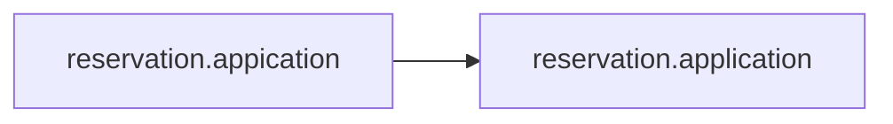
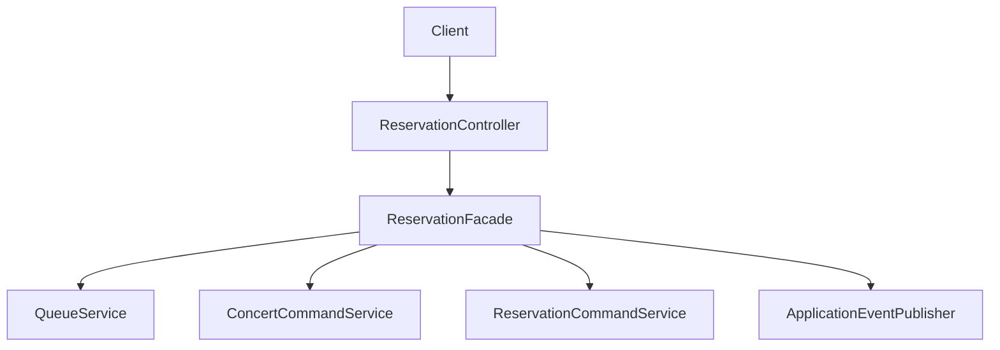

# [REFACTOR-2] STEP-2 서버 구조 재정리

## 목표

패키지명, API 계층 책임, 실습 코드 runtime 등록 문제를 정리한다. 비즈니스 동작은 변경하지 않고 서버 구조를 더 읽기 쉽게 만든다.

## 변경 전

### 예약 application 패키지 오타

예약 application service 패키지가 `reservation.appication`으로 되어 있었다.

대상:

- `ReservationCommandService`
- `ReservationQueryService`
- `ReservationExpireService`
- `ReservationExpireScheduler`
- `ReservationTokenService`

### Controller의 use case 흐름 제어

`ReservationController`가 HTTP 요청/응답 처리 외에 대기열 acquire/release 흐름까지 직접 처리했다.

```java
boolean acquired = queueService.tryAcquire(request.userId());

if (!acquired) {
    throw new IllegalStateException("대기 순서가 아닙니다.");
}

try {
    return reservationFacade.initReservation(...);
} finally {
    queueService.release();
}
```

이 구조에서는 예약 use case 진입 정책이 API 계층에 박혀 있어, 다른 진입점에서 같은 예약 흐름을 사용할 때 정책이 누락될 수 있다.

### Kafka 실습 코드 runtime 등록

Kafka 실습용 producer/controller/consumer가 기본 Spring profile에서도 bean으로 등록될 수 있었다.

대상:

- `ProducerController`
- `ProducerService`
- `ConsumerService`

## 변경 내용

### 패키지명 정리

`reservation.appication`을 `reservation.application`으로 변경했다.



### 예약 controller 책임 축소

`ReservationController`는 요청 DTO를 facade에 전달하는 역할만 담당하도록 변경했다.

```java
@PostMapping
public ReservationResponse reserve(@RequestBody ReservationRequest request) {
    return reservationFacade.reserve(
            request.userId(),
            request.concertSeatId(),
            request.token()
    );
}
```

대기열 acquire/release 흐름은 `ReservationFacade.reserve`로 이동했다.

```java
public ReservationResponse reserve(Long userId, Long concertSeatId, String token) {
    boolean acquired = queueService.tryAcquire(userId);

    if (!acquired) {
        throw new IllegalStateException("대기 순서가 아닙니다.");
    }

    try {
        return initReservation(concertSeatId, userId, token);
    } finally {
        queueService.release();
    }
}
```

### Kafka 실습 코드 profile 제한

Kafka 실습용 bean은 `kafka-practice` profile에서만 등록되도록 제한했다.

```java
@Profile("kafka-practice")
@RestController
public class ProducerController {
}
```

```java
@Profile("kafka-practice")
@Service
public class ConsumerService {
}
```

## 변경 후 구조



Controller는 API adapter 역할에 집중하고, 예약 use case 흐름은 facade가 조합한다.

## 관련 개념

### Controller와 Use Case 책임

Controller는 HTTP 요청을 애플리케이션 use case로 전달하고 응답을 반환하는 adapter로 두는 것이 좋다. 대기열 진입 가능 여부, 예약 생성 순서, release 보장 같은 업무 흐름은 application/facade 계층에 두면 재사용성과 테스트가 좋아진다.

### Spring Profile

`@Profile`은 특정 profile이 활성화된 경우에만 bean을 등록하게 해주는 Spring 기능이다. 실습용 Kafka producer/consumer는 기본 runtime에서 실행될 필요가 없으므로 `kafka-practice` profile로 제한했다.

실습 실행 예:

```bash
SPRING_PROFILES_ACTIVE=local,kafka-practice ./gradlew bootRun
```

## 테스트

리팩토링 후 실행한 테스트:

```bash
./gradlew build
```

결과:

- `BUILD SUCCESSFUL`
- 컴파일, 테스트 컴파일, 전체 테스트, build task 통과
- shutdown hook에서 MySQL connection 정리 경고가 출력되었지만 build 실패로 이어지지는 않았다.

중점 확인 결과:

- 패키지 rename 이후 컴파일이 깨지지 않는지 확인했다.
- `ReservationControllerTest`가 controller의 facade 위임만 검증하는지 확인했다.
- `ReservationFacadeTest`가 대기열 acquire/release 흐름을 검증하는지 확인했다.
- `kafka-practice` profile을 켜지 않아도 application context가 실습용 Kafka listener 때문에 영향을 받지 않는지 확인했다.

## 남은 작업

- 토큰 검증/소비 주석 해제는 REFACTOR-3에서 다룬다.
- Kafka topic 설정화와 outbox 패턴은 REFACTOR-9에서 다룬다.
- 예외 응답 정리는 REFACTOR-10에서 다룬다.
