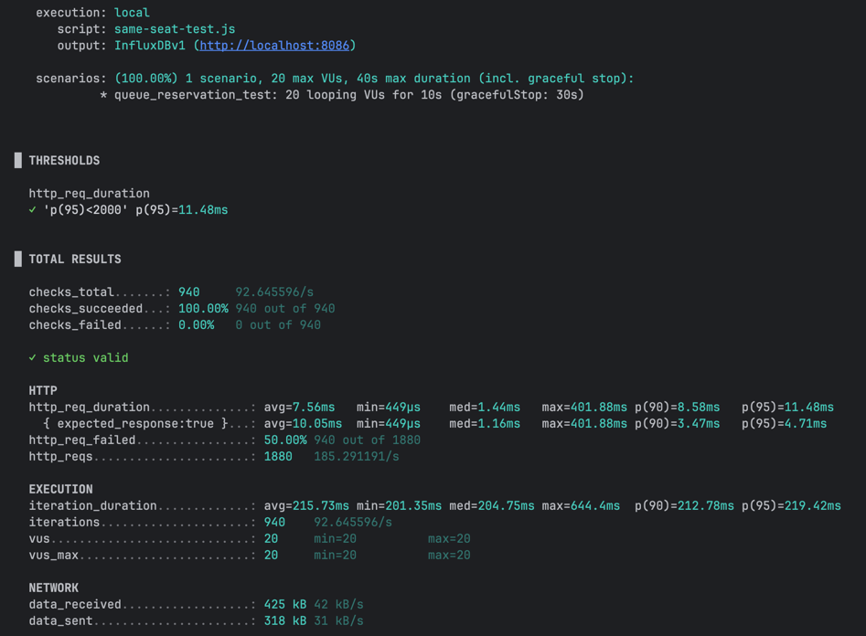

# k6 Load Test

콘서트 예약 시스템 부하테스트용 스크립트.

## 테스트 종류

### 1. same-seat-test.js

동일 좌석 동시 예약 테스트.

목적:
- 중복 예약 방지 확인
- 동시성 제어 검증
- 락 검증

기대 결과:
- 성공 1건
- 나머지 실패

실행:

```bash
k6 run same-seat-test.js
```

### 2. random-seat-test.js

랜덤 좌석 예약 테스트.

목적:
- 서버 처리량(TPS) 측정
- 병목 구간 분석
- DB connection pool 상태 확인
- Thread pool 상태 확인
- Redis/Queue 처리량 확인

시나리오:
- 여러 유저가 랜덤한 좌석에 동시에 예약 요청

예시:
- user1 → seat 15
- user2 → seat 87
- user3 → seat 42

특징:
- 락 경쟁이 줄어듦
- 실제 서버 처리 성능 분석에 적합
- 동일 좌석 테스트보다 TPS가 높게 나옴

확인 포인트:
- 응답속도(p95)
- TPS
- 실패율
- CPU 사용량
- DB connection 사용량

실행:

```bash
k6 run random-seat-test.js
```

# 3. 테스트 결과

## 1. 테스트 개요
- 20 VUs 동시 요청
- 10초 실행
- Queue + Reservation API 테스트

---

## 2. 결과

- p95 응답시간: **11.48ms**
- 평균 응답시간: **7.56ms**
- 최대 응답시간: **401ms**
- 실패율: **50%**
- 처리량: **185 req/s**
- 실제 DB에 seat status 상태 변경(HOLD), 1개의 reservation정상 생성 확인 완료

---

## 3. 해석

### ✅ 성능
- 매우 빠름 (Redis 기반 구조 정상)

### ⚠️ 실패율 50%
- 장애 아님
- MAX_ACTIVE = 5 제한으로 인한 정상 동작

---

## 4. 결론
> 시스템 성능은 안정적이며,
> 실패율은 동시 접속 제한 정책에 따른 정상 결과